# Application Workflows — Backend → Frontend

> Step-by-step flows for how data moves through the system. Read **Part 1 (Backend)** first, then **Part 2 (Frontend)**.

Related: [PROJECT_GUIDE.md](./PROJECT_GUIDE.md) | [architecture/overview.md](./architecture/overview.md) | **[Visual diagrams](./diagrams/system-diagrams.md)**

---

## Table of contents

**Part 1 — Backend**
1. [Server startup](#1-backend-server-startup)
2. [Every HTTP request pipeline](#2-backend-every-http-request-pipeline)
3. [Layer pattern (all modules)](#3-backend-layer-pattern-all-modules)
4. [Auth workflow](#4-backend-auth-workflow)
5. [Public content workflow](#5-backend-public-content-workflow)
6. [Admin CRUD workflow (projects example)](#6-backend-admin-crud-workflow-projects)
7. [Media upload workflow](#7-backend-media-upload-workflow)
8. [Contact & leads workflow](#8-backend-contact--leads-workflow)
9. [Ask Ishan AI workflow](#9-backend-ask-ishan-ai-workflow)
10. [Analytics workflow](#10-backend-analytics-workflow)
11. [Error handling workflow](#11-backend-error-handling)

**Part 2 — Frontend**
12. [App bootstrap](#12-frontend-app-bootstrap)
13. [Routing & layouts](#13-frontend-routing--layouts)
14. [API client & proxy](#14-frontend-api-client--proxy)
15. [Public page workflow (SSR)](#15-frontend-public-page-workflow-ssr)
16. [Admin page workflow (CSR)](#16-frontend-admin-page-workflow-csr)
17. [Auth workflow (frontend)](#17-frontend-auth-workflow)
18. [Form + mutation workflow](#18-frontend-form--mutation-workflow)
19. [Media upload workflow (frontend)](#19-frontend-media-upload-workflow)

**End-to-end**
20. [Full journey maps](#20-full-end-to-end-journey-maps)

---

# Part 1 — Backend

## 1. Backend server startup

**Entry file:** `backend/src/server.ts`

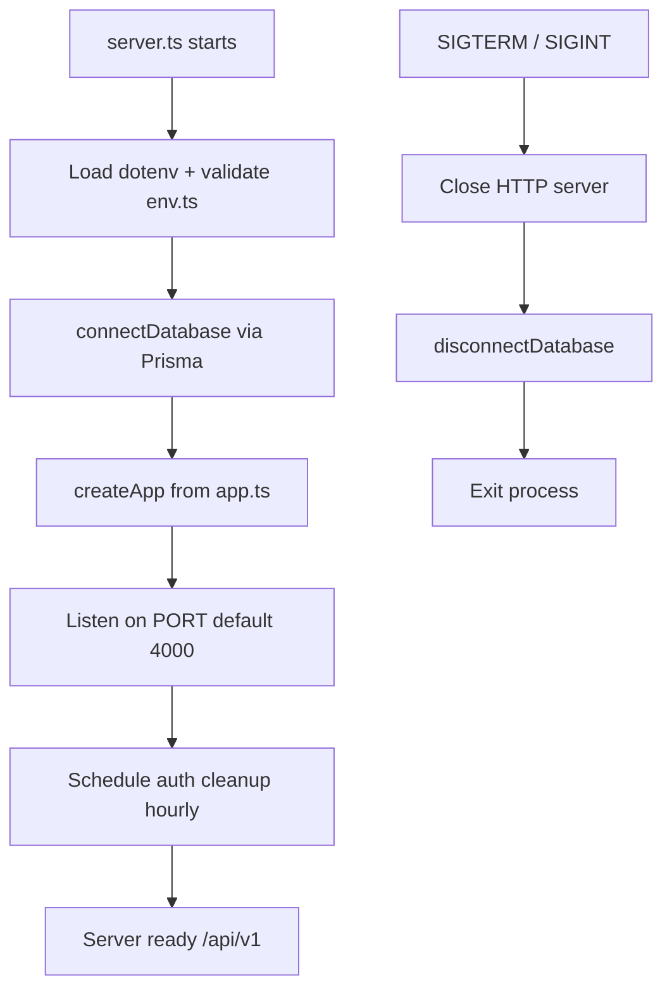

| Step | File | What happens |
|------|------|--------------|
| 1 | `server.ts` | Loads environment variables |
| 2 | `config/env.ts` | Zod validates all required env vars; exits if invalid |
| 3 | `lib/prisma.ts` | Connects to PostgreSQL (Neon) |
| 4 | `app.ts` | Builds Express app with middleware + routes |
| 5 | `server.ts` | Starts listening; logs port and environment |

---

## 2. Backend every HTTP request pipeline

**Every request** passes through this chain before reaching a module:

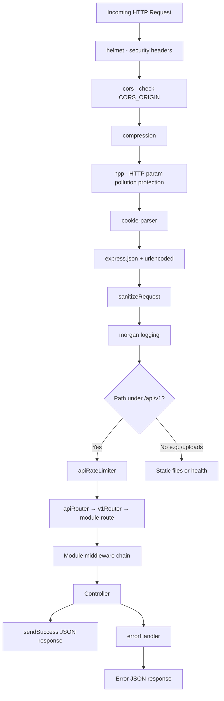

### Route mounting (`routes/v1/index.ts`)

```
/api/v1
├── /auth              → authRouter
├── /public            → publicRouter (no auth)
├── /public/ai         → aiPublicRouter
├── /projects          → projectsRouter
├── /blog              → blogRouter
├── /blog/categories   → blogCategoriesRouter
├── /media             → mediaRouter
├── /leads             → leadsRouter
├── /testimonials      → testimonialsRouter
├── /resume            → resumeRouter
├── /knowledge-base    → knowledgeBaseRouter
├── /analytics         → analyticsRouter
├── /settings          → settingsRouter
├── /tags              → tagsRouter
└── /ai                → aiAdminRouter
```

---

## 3. Backend layer pattern (all modules)

Every feature module follows the same internal flow:

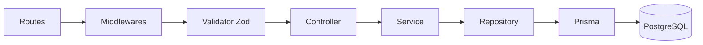

| Layer | Responsibility | Example file |
|-------|----------------|--------------|
| **Routes** | HTTP method + path + middleware stack | `projects.routes.ts` |
| **Validator** | Zod schema for body/query/params | `projects.validator.ts` |
| **Controller** | Read req, call service, format response | `projects.controller.ts` |
| **Service** | Business rules, permissions checks | `projects.service.ts` |
| **Repository** | Database queries only | `project.repository.ts` |
| **DTO** | Map DB models → API shape | `projects.dto.ts` |

### Typical admin route middleware chain

```
authorizeStrict(PERMISSIONS.XYZ)   →  authenticate + requirePermission
validateBody / validateQuery       →  Zod parse
controller.action                  →  asyncHandler wraps try/catch
```

---

## 4. Backend auth workflow

### Login

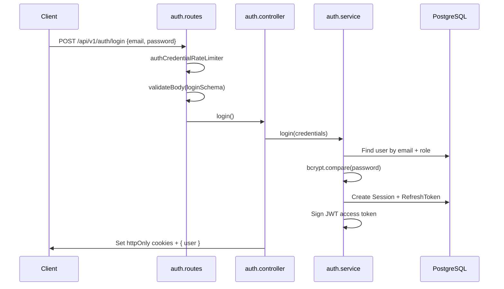

### Authenticated request

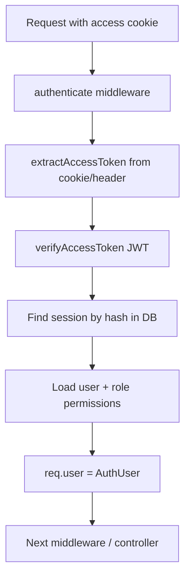

### Refresh token

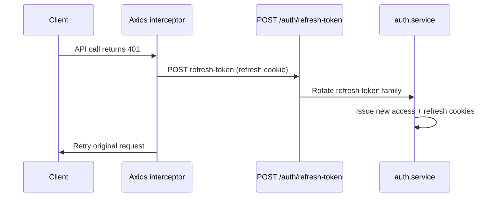

---

## 5. Backend public content workflow

**No authentication.** Used by the public portfolio site (SSR from Next.js).

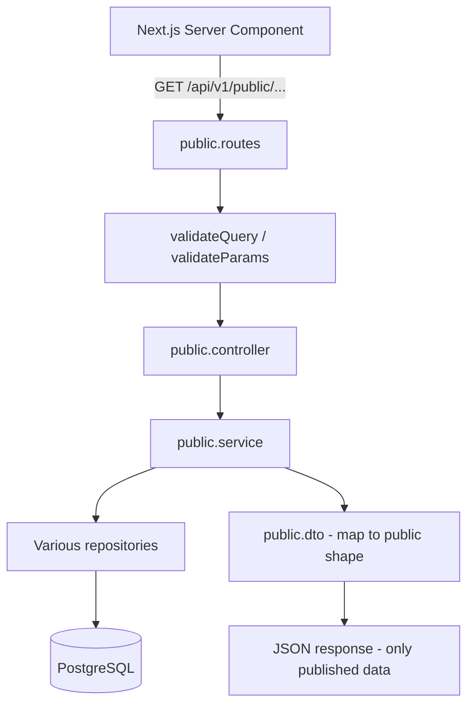

### Public endpoints

| Endpoint | Returns |
|----------|---------|
| `GET /public/site` | Site name, description, logo, social links |
| `GET /public/about` | About page sections |
| `GET /public/projects` | Published projects list |
| `GET /public/projects/:slug` | Single published project + media |
| `GET /public/blog` | Published blog posts |
| `GET /public/blog/:slug` | Single published post |
| `GET /public/testimonials` | Testimonials |
| `GET /public/resume` | Active resume PDF URL |
| `GET /public/services` | Services content |
| `GET /public/analytics/stats` | Visitor count |
| `POST /public/analytics/visit` | Record a visit |

---

## 6. Backend admin CRUD workflow (projects)

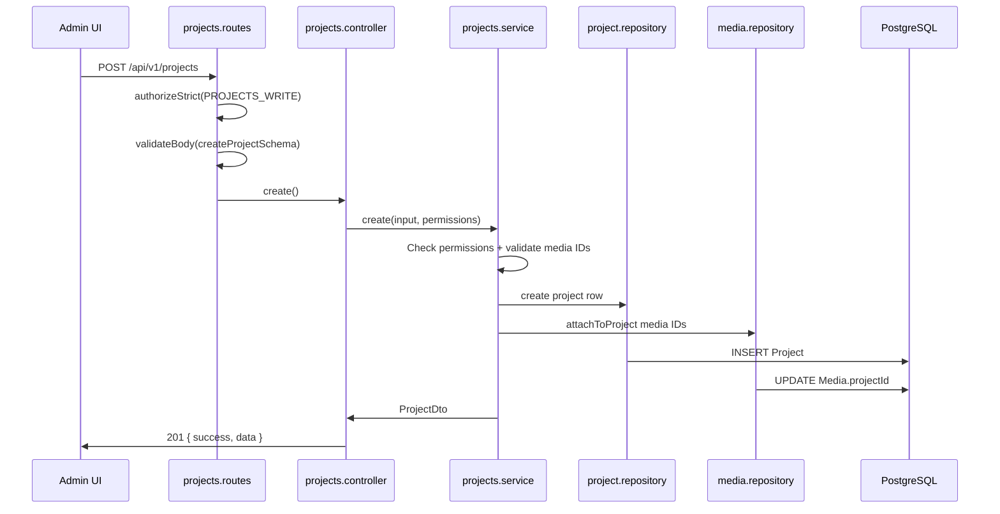

### Project delete (includes media cleanup)

```
DELETE /projects/:id
  → projects.service.delete()
  → projectRepository.delete()
  → For each media: deleteStoredFile() (Cloudinary or local)
  → mediaRepository.delete()
```

---

## 7. Backend media upload workflow

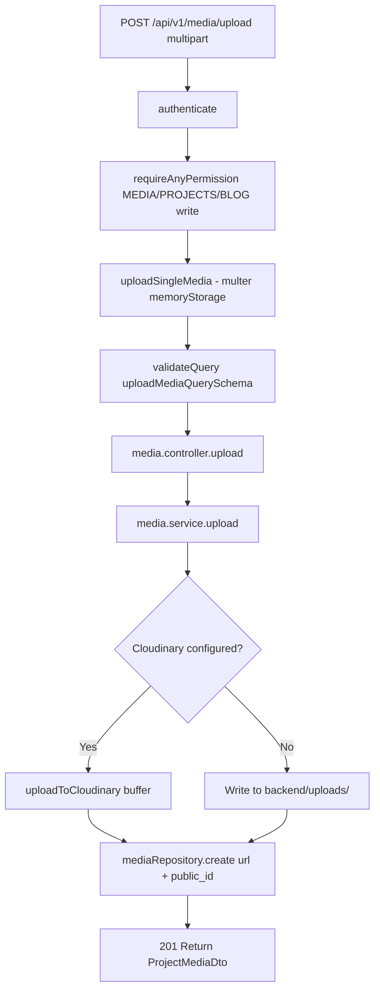

| Field stored | Cloudinary | Local fallback |
|--------------|------------|----------------|
| `url` | `https://res.cloudinary.com/...` | `http://localhost:4000/uploads/uuid.jpg` |
| `filename` | Cloudinary public_id | UUID filename |
| `type` | IMAGE / VIDEO / DOCUMENT | Same |

**Resume PDF upload:** Same flow via `POST /api/v1/resume/upload` → folder `portfolio/resumes` → resource type `raw`.

---

## 8. Backend contact & leads workflow

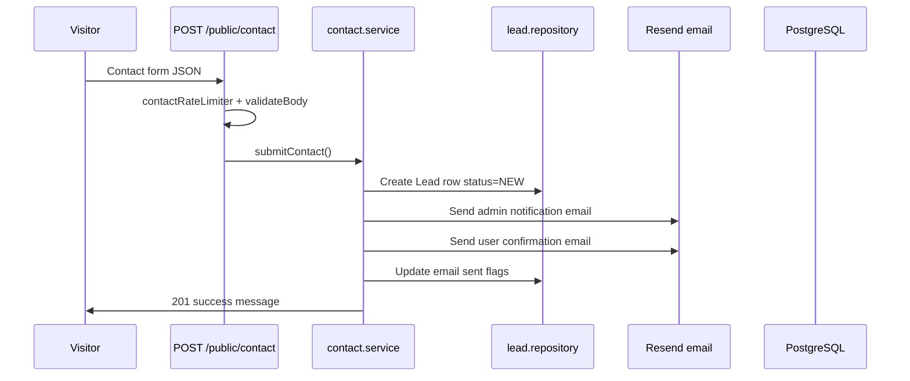

### Admin lead management

```
GET  /api/v1/leads          → list/filter leads
GET  /api/v1/leads/:id      → lead detail + notes
PATCH /api/v1/leads/:id     → update status (NEW → CONTACTED → CLOSED)
POST /api/v1/leads/:id/notes → add internal note
```

---

## 9. Backend Ask Ishan AI workflow

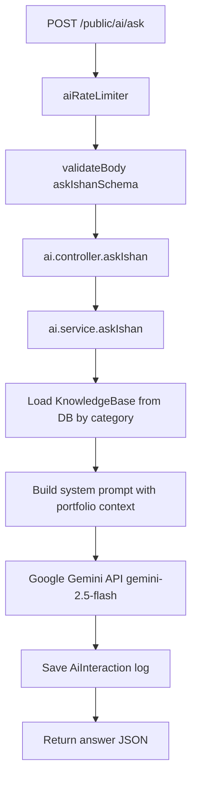

**Knowledge base admin:** `CRUD /api/v1/knowledge-base` — content seeded for About, Skills, Projects, FAQ, etc.

---

## 10. Backend analytics workflow

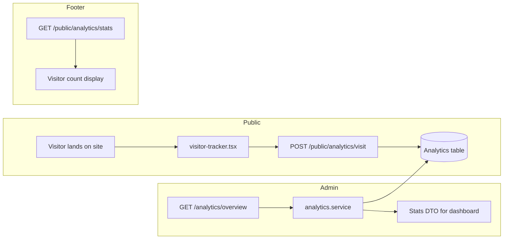

---

## 11. Backend error handling

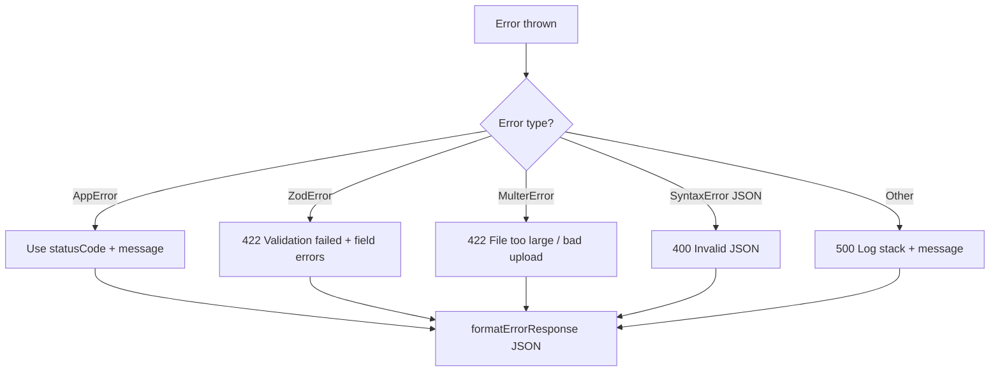

**Response shape:**
```json
{ "success": false, "message": "...", "errors": { "field": ["..."] } }
```

---

# Part 2 — Frontend

## 12. Frontend app bootstrap

**Entry:** `frontend/src/app/layout.tsx`

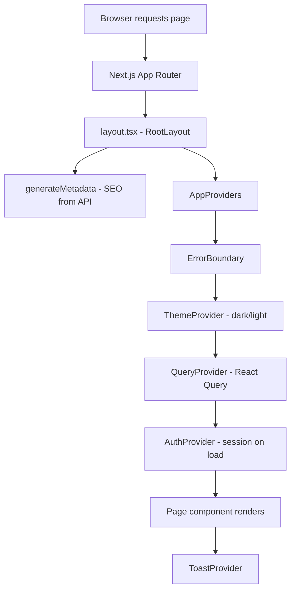

---

## 13. Frontend routing & layouts

```
frontend/src/app/
├── layout.tsx              # Root: providers, fonts, global CSS
├── (main)/                 # Public portfolio layout
│   ├── layout.tsx          # Header + footer + visitor tracker
│   ├── page.tsx            # Home
│   ├── projects/
│   ├── blog/
│   ├── contact/
│   └── ask-ishan/
├── (admin)/                # Admin shell layout
│   ├── layout.tsx          # Sidebar + breadcrumbs
│   ├── dashboard/
│   ├── admin/projects/
│   ├── admin/blog/
│   ├── leads/
│   └── settings/
├── (auth)/                 # Login / register (minimal layout)
└── api/proxy/[...path]/    # Backend proxy route
```

### Middleware gate (`middleware.ts`)

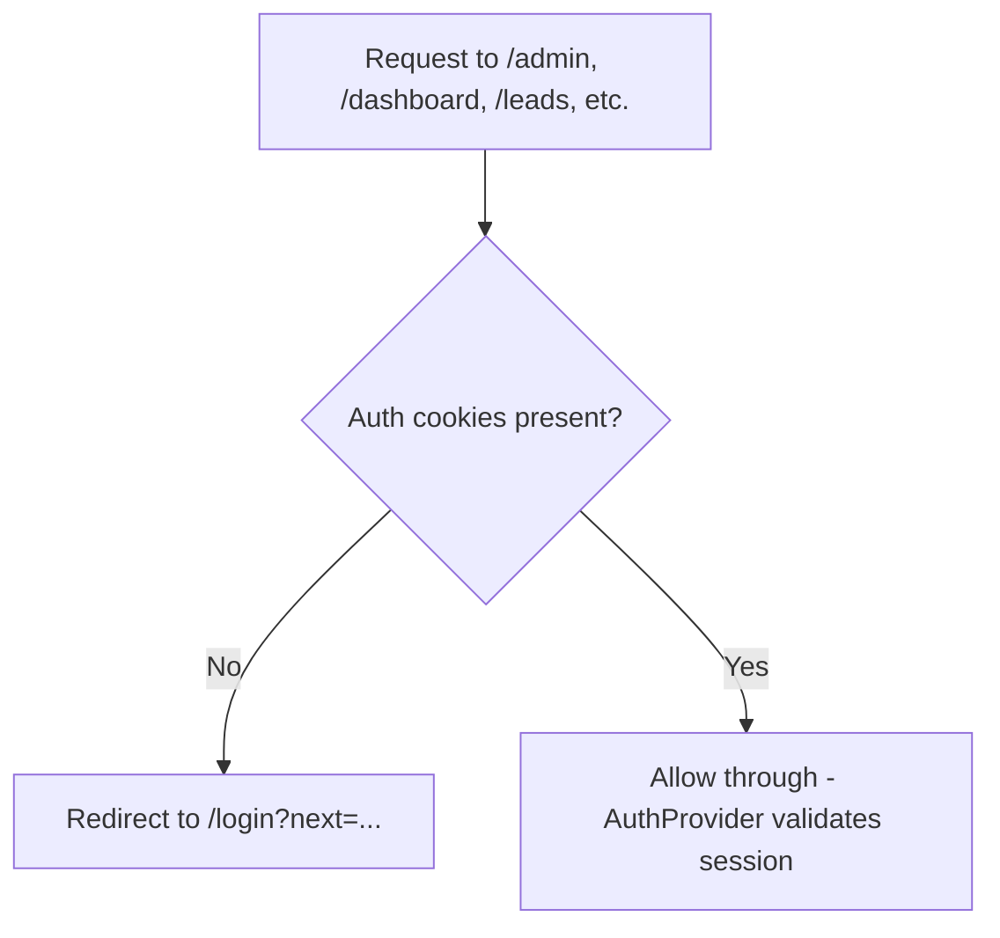

---

## 14. Frontend API client & proxy

### Why a proxy?

Browser calls **`/api/proxy/v1/*`** (same origin on Vercel) instead of Render directly. This keeps **httpOnly auth cookies** working in production.

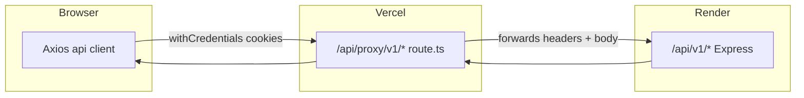

| Context | Base URL | Used by |
|---------|----------|---------|
| Browser (client) | `/api/proxy/v1` | Admin hooks, forms, axios |
| Server (SSR) | `NEXT_PUBLIC_API_URL` directly | `publicApi`, `generateMetadata` |

**Key files:**
- `services/api.ts` — Axios instance + 401 refresh interceptor
- `app/api/proxy/[...path]/route.ts` — forwards GET/POST/PATCH/DELETE
- `lib/public-api.ts` — server-side fetch for public pages
- `constants/api.ts` — all endpoint paths

---

## 15. Frontend public page workflow (SSR)

Example: **`/projects/my-project`**

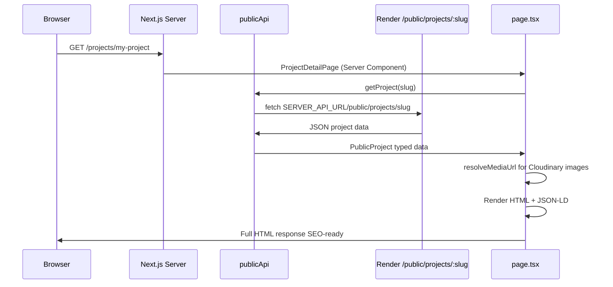

### Public data fetching pattern

```typescript
// Server Component (runs on Vercel at request time)
const project = await publicApi.getProject(slug);
return <article>...</article>;
```

- Revalidates every 60 seconds (`revalidate: 60` in publicApi)
- Images via `MediaImage` component (Cloudinary-safe)

---

## 16. Frontend admin page workflow (CSR)

Example: **`/admin/projects`** list + edit

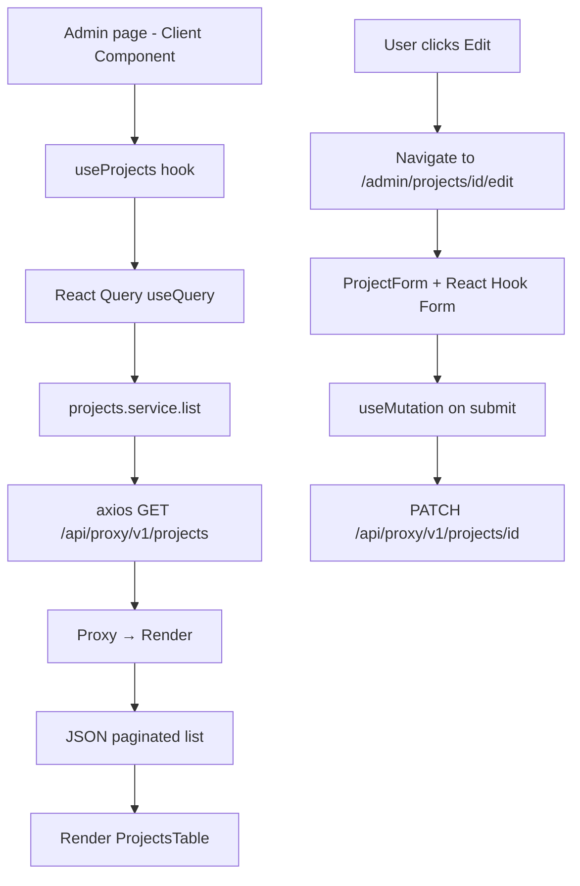

### Admin feature file flow

```
page.tsx (thin)
  └── FeatureView component
        ├── hooks/use-projects.ts      (React Query)
        ├── services/projects.service.ts (API calls)
        ├── schemas/project.schemas.ts (Zod)
        └── components/project-form.tsx (UI + form)
```

---

## 17. Frontend auth workflow

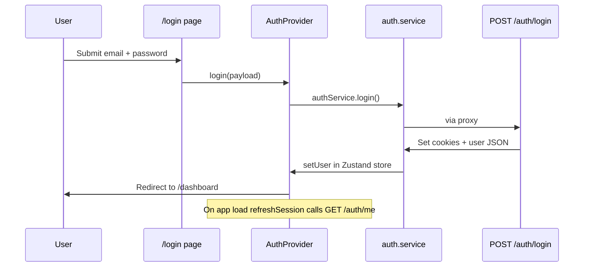

**Permission checks in UI:**
```typescript
const { hasPermission } = useAuth();
if (hasPermission('projects:write')) { /* show edit button */ }
```

---

## 18. Frontend form + mutation workflow

Standard pattern for admin create/update:

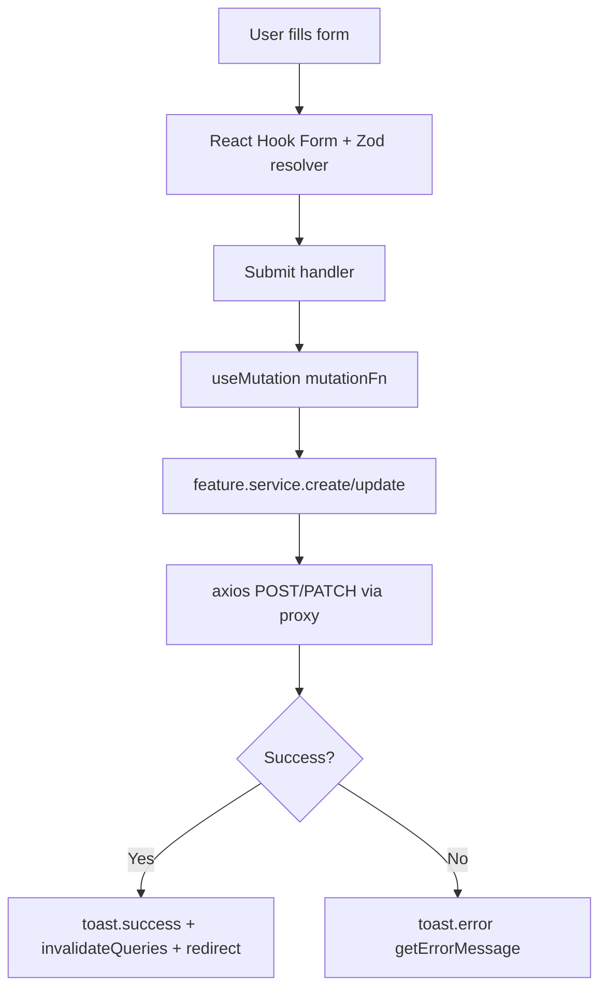

---

## 19. Frontend media upload workflow

```mermaid
sequenceDiagram
    participant U as Admin user
    participant F as ImageUploadField
    participant MS as mediaService.upload
    participant PX as /api/proxy/v1/media/upload
    participant BE as media.service + Cloudinary
    participant UI as Preview update

    U->>F: Choose file
    F->>MS: FormData with file
    MS->>PX: POST multipart
    PX->>BE: Forward binary body
    BE->>BE: Upload to Cloudinary
    BE->>MS: { url, id, mimeType }
    MS->>F: ProjectMedia object
    F->>UI: MediaImage shows Cloudinary URL
    F->>U: onChange(media) updates form state
```

On project save → form sends `thumbnailMediaId` + `galleryMediaIds` → backend links media to project.

---

# Part 3 — End-to-end journey maps

## Journey 1: Visitor reads a blog post

```
1. Browser → Vercel GET /blog/my-slug
2. Next.js Server → publicApi.getBlogPost(slug)
3. Render GET /api/v1/public/blog/my-slug
4. public.service → blogRepository.findBySlug (published only)
5. HTML rendered with title, content, featured image
6. Browser loads Cloudinary image URL
7. visitor-tracker records POST /public/analytics/visit
```

## Journey 2: Admin publishes a new project

```
1. Login → cookies set via proxy
2. /admin/projects/new → ProjectForm
3. Upload thumbnail → POST /media/upload → Cloudinary URL returned
4. Upload gallery images → same flow
5. Submit form → POST /projects with media IDs
6. projects.service creates Project + links Media
7. Set status PUBLISHED → PATCH /projects/:id/status
8. Public site → GET /public/projects shows new project (SSR)
```

## Journey 3: Visitor submits contact form

```
1. /contact page → ContactForm (client)
2. POST /api/proxy/v1/public/contact
3. contact.service → Lead in DB + Resend emails
4. Admin sees lead at /leads pipeline
5. Admin updates status + adds notes
```

## Journey 4: Ask Ishan AI question

```
1. /ask-ishan page → chat UI
2. POST /api/proxy/v1/public/ai/ask { message }
3. ai.service loads KnowledgeBase from DB
4. Gemini generates answer with portfolio context
5. AiInteraction logged
6. Answer displayed in chat
```

---

## Quick reference: which file to open

| I want to understand… | Backend | Frontend |
|----------------------|---------|----------|
| Server boot | `server.ts`, `app.ts` | `app/layout.tsx` |
| Route list | `routes/v1/index.ts` | `app/**/page.tsx` |
| Auth | `modules/auth/` | `features/auth/` |
| Public API | `modules/public/` | `lib/public-api.ts` |
| Projects | `modules/projects/` | `features/projects/` |
| Blog | `modules/blog/` | `features/blog/` |
| Uploads | `modules/media/`, `lib/cloudinary.ts` | `image-upload-field.tsx` |
| DB schema | `prisma/schema.prisma` | — |
| Proxy | — | `app/api/proxy/[...path]/route.ts` |
| SEO | — | `lib/seo/` |

---

*See also: [PROJECT_GUIDE.md](./PROJECT_GUIDE.md) for tech stack and schema details.*
