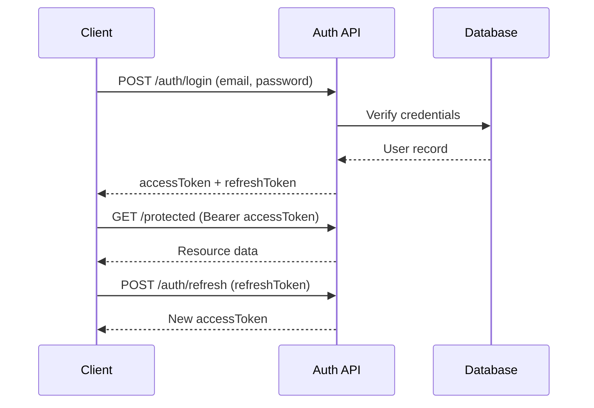
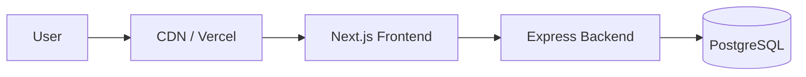

# System Design

## Entity Relationships (Planned)

```
User 1──1 Portfolio
User 1──* Project
Portfolio 1──* Project (optional association)
ContactMessage *──? User (optional, for logged-in submissions)
```

## Authentication Flow



## Deployment Topology (Target)



## Scalability Considerations

- **Horizontal scaling:** Stateless backend instances behind a load balancer
- **Database:** Connection pooling via PgBouncer in production
- **Caching:** Redis for session/rate-limiting (future phase)
- **File storage:** S3-compatible object storage for portfolio assets (future phase)
