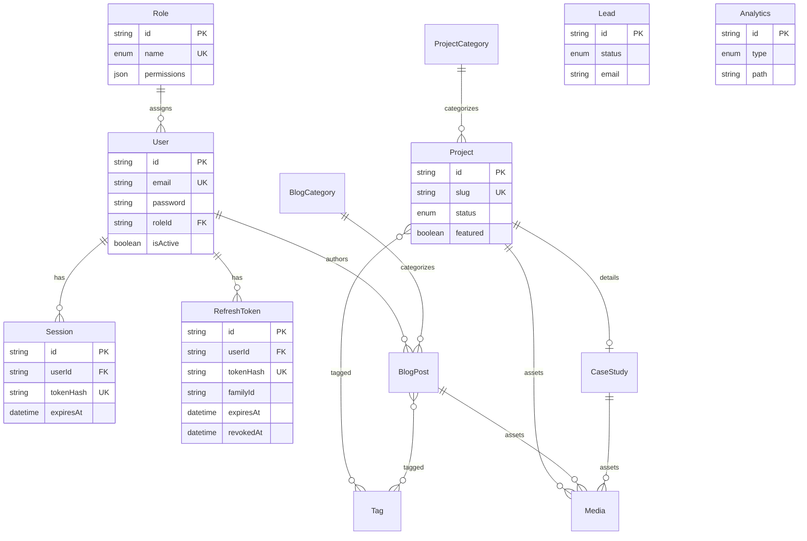

# Entity Relationship Diagram

## Enums

| Enum | Values |
| ---- | ------ |
| `RoleName` | ADMIN, EDITOR, USER |
| `ProjectStatus` | DRAFT, PUBLISHED, ARCHIVED |
| `LeadStatus` | NEW, CONTACTED, IN_PROGRESS, CLOSED |
| `MediaType` | IMAGE, DOCUMENT, VIDEO, OTHER |
| `AnalyticsEventType` | VISIT, PAGE_VIEW, CONTACT_REQUEST, DOWNLOAD |
