# System Diagrams

Visual architecture for the Professional Portfolio platform.  
These diagrams render on GitHub and in VS Code/Cursor markdown preview.

Related: [WORKFLOW.md](../WORKFLOW.md) | [PROJECT_GUIDE.md](../PROJECT_GUIDE.md)

---

## 1. System overview (high level)

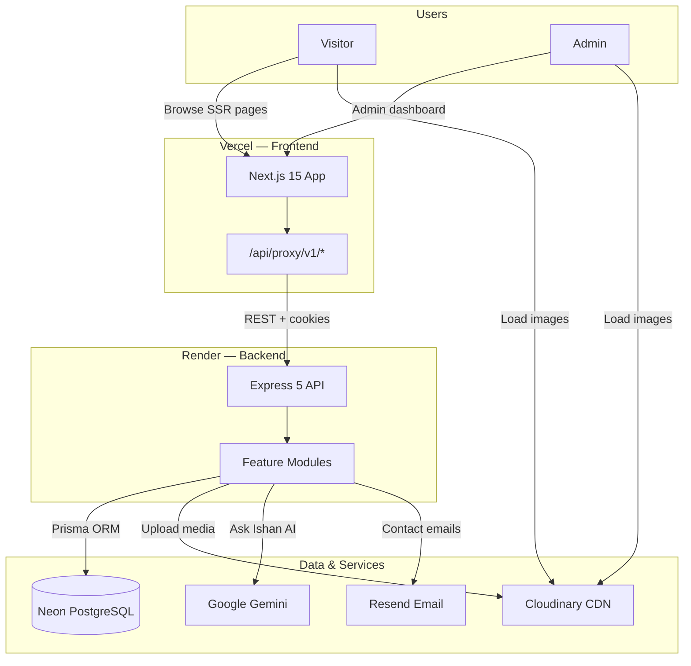

---

## 2. Deployment topology

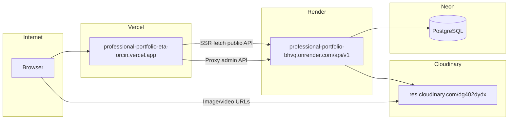

---

## 3. Backend — request pipeline

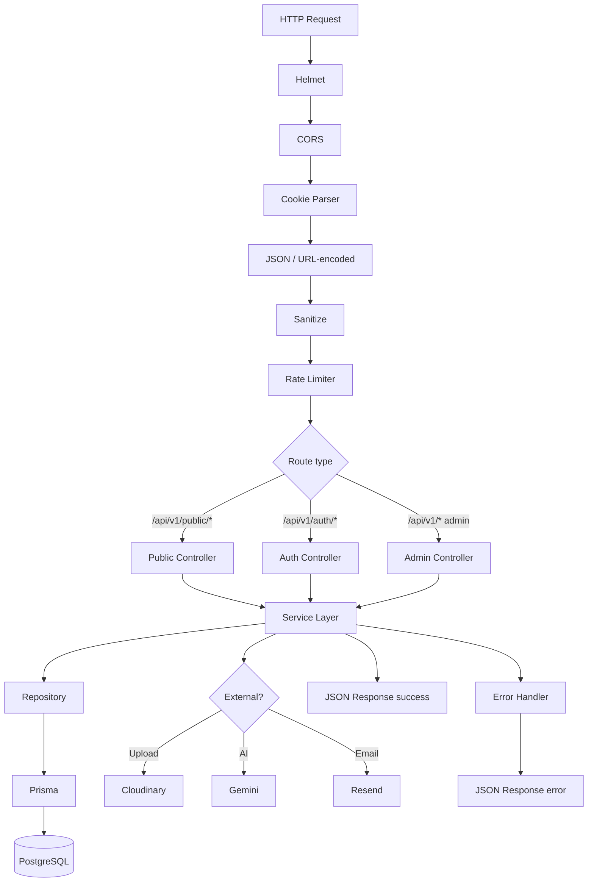

---

## 4. Backend — module map

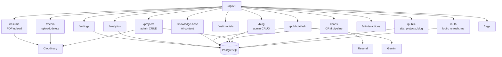

---

## 5. Backend — layered architecture (per module)

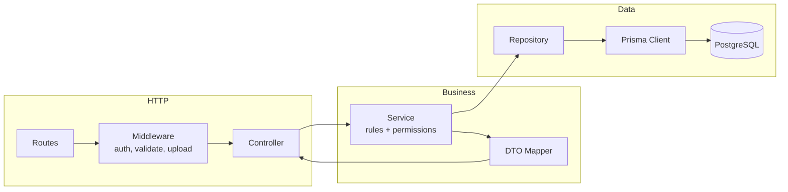

---

## 6. Database — entity relationships

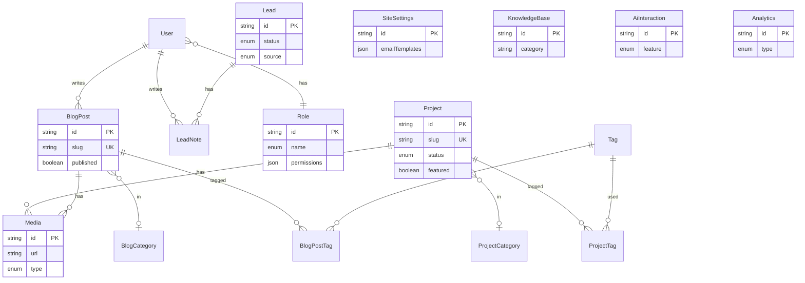

---

## 7. Frontend — app structure

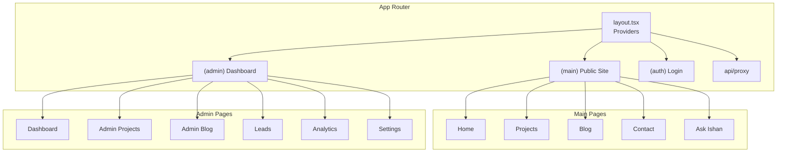

---

## 8. Frontend — data fetching modes

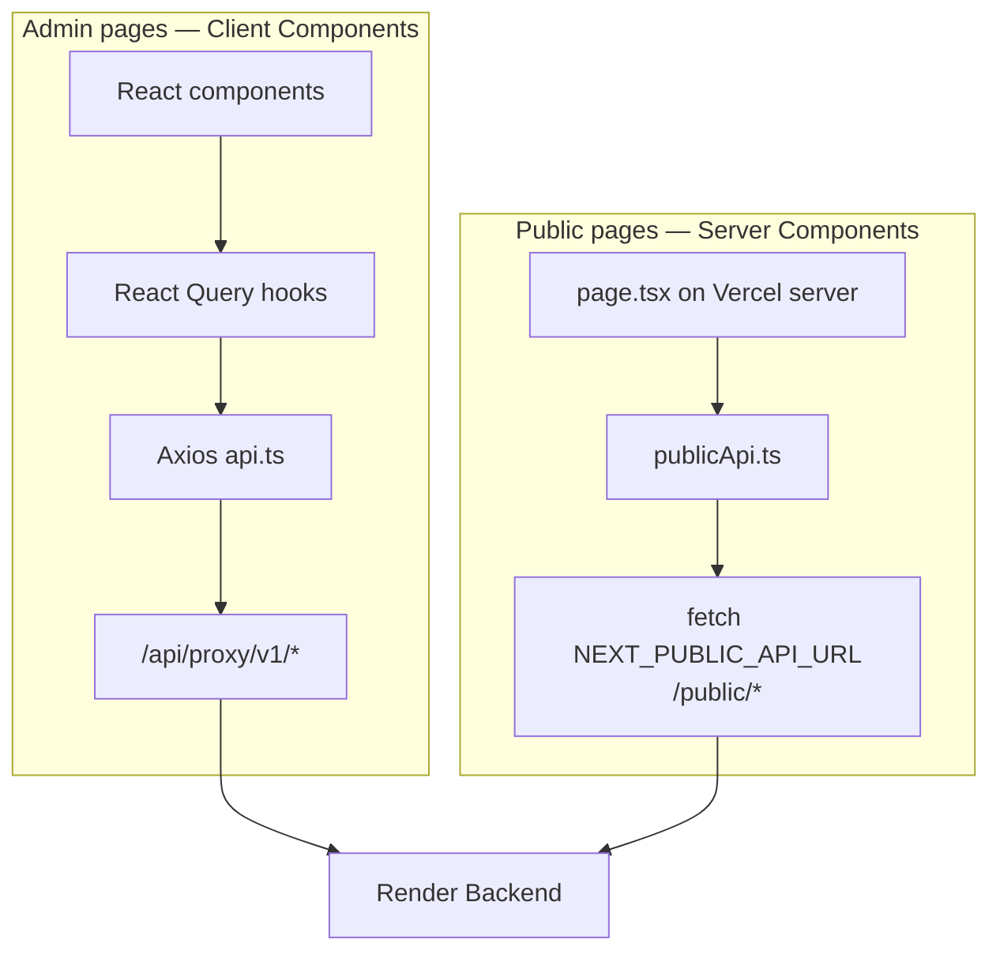

---

## 9. Authentication sequence

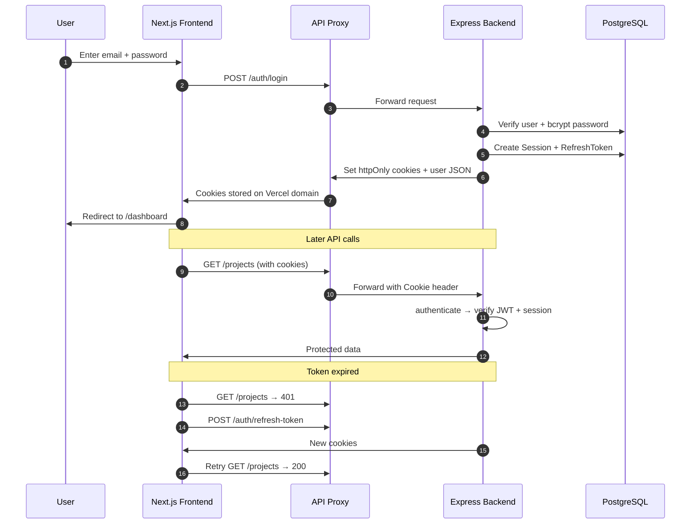

---

## 10. Media upload flow (end-to-end)

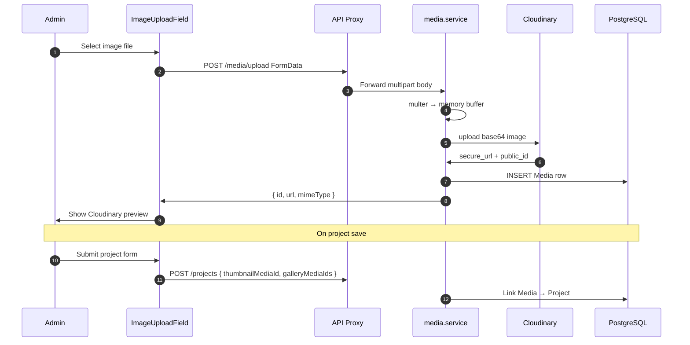

---

## 11. Public blog page flow

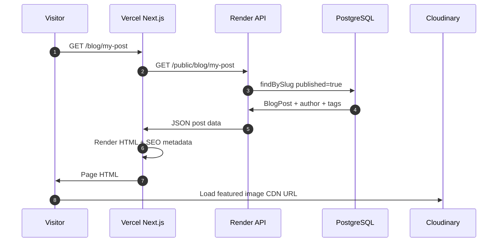

---

## 12. Contact form → lead pipeline

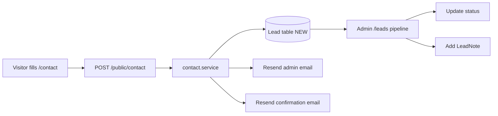

---

## 13. Ask Ishan AI flow

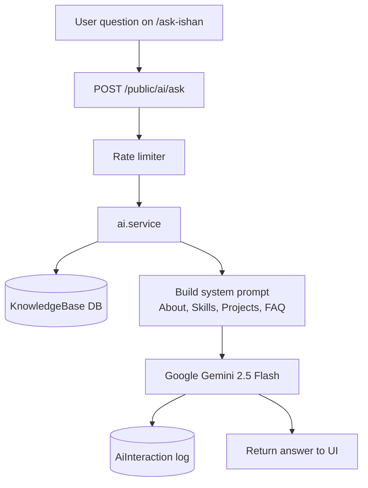

---

## How to view these diagrams

| Tool | How |
|------|-----|
| **GitHub** | Open this file — Mermaid renders automatically |
| **VS Code / Cursor** | Markdown preview (`Ctrl+Shift+V`) |
| **Mermaid Live** | Copy a diagram block to [mermaid.live](https://mermaid.live) |
| **Export PNG/SVG** | Paste into mermaid.live → Export |

---

## Diagram index

| # | Diagram | Purpose |
|---|---------|---------|
| 1 | System overview | Explain whole platform in one picture |
| 2 | Deployment | Vercel + Render + Neon + Cloudinary |
| 3 | Request pipeline | Every backend middleware step |
| 4 | Module map | All API route groups |
| 5 | Layered architecture | Routes → Service → Repository |
| 6 | Database ERD | Tables and relationships |
| 7 | Frontend structure | App Router route groups |
| 8 | Data fetching | SSR vs client/proxy |
| 9 | Auth sequence | Login, cookies, refresh |
| 10 | Media upload | Cloudinary end-to-end |
| 11 | Blog page | Public SSR flow |
| 12 | Contact/leads | CRM pipeline |
| 13 | Ask Ishan AI | Gemini + knowledge base |
